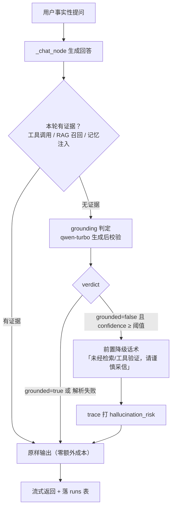

# 变更提案 · 幻觉闸门：无据不答（生成后 grounding 判定 + 降级）

> 状态：已确认
> 变更 ID：20260923-111235-hallucination-gate
> 变更类型：新功能
> 分级：标准

## 1. 目标（一句话）

给「事实性问答」加一道生成后闸门：当最终回答里的关键事实**没有工具结果 / 检索召回 / 长期记忆 / 用户原文**等证据支撑时，量化其「无据风险」并降级（前置「未经检索验证」提示 + trace 打 `hallucination_risk` 标），而不是让模型硬编；有证据支撑的回答不受影响。

## 2. 验收标准（怎么算「对」）

- [ ] 「无证据的事实问答」会被 trace 打上 `hallucination_risk` flag（/traces 面板可查）
- [ ] 被判定高风险的回答会附加「未经检索/工具验证，请谨慎采信」的降级话术（**默认标注、不拒答**）
- [ ] 「有工具/RAG/记忆支撑」的回答不触发判定、不被误伤（零额外成本、零改字）
- [ ] 判定结果（verdict + confidence + 无据片段）落 trace，可回溯
- [ ] 判定本身失败时降级为「不拦截、只告警」，不阻塞主对话流
- [ ] 判定解析 + 触发条件 + 降级注入 + flag 落库 各有 pytest 覆盖，独立验证全绿

## 3. 依据

- **需求依据**：用户原话「先做 phase3 吧」（幻觉闸门）、「版本里不用体现 phase3 的词汇」；原始九缺口中的「幻觉量化」。
- **技术依据**：
  - `backend/store/feedback.py` 已有用户标签 `hallucination`（`schemas.py` 注释同），闸门可与该标签对齐（用户可继续人工标、机器自动标互补）。
  - `backend/tracing/collector.py` 已有 `add_flag()` + `finalize()` 自动打标机制（`tool_error`/`no_answer`/`pending_confirm` 同款），直接复用加 `hallucination_risk`。
  - `backend/agent/memory.py` 已在用 `qwen-turbo`（`MEMORY_MODEL`）+ `resolve_api_key` 取用户 Key，判定模型可同款复用，零新依赖。
  - `backend/agent/prompts.py` 分层结构 + `PROMPT_VERSION`，可加「grounding 判定」层并递增版本。
  - `backend/agent/graph.py` `_chat_node` 与 `backend/api/streaming.py` 收口处是天然 hook 点。

## 4. 方案（怎么做 + 为什么选它）

**一句话方案**：新增 `backend/agent/grounding.py`，在「无据高风险场景」下用 `qwen-turbo` 做一次生成后判定（critic 模式），输出结构化 `{grounded, confidence, ungrounded_spans, reason}`，按结果决定「标注式降级 + 打标」。

**为什么选它**：语义级幻觉（「埃菲尔铁塔在伦敦」vs「2+2=4」）只能靠判定模型抓，启发式/规则分不清；`qwen-turbo` 便宜且已在用。

**备选**：① 纯启发式（无工具 + 事实问句 → 打标）——零成本但误报率高；② embedding 相似度（RAGAS faithfulness 路线）——需额外向量基建、重。均不选。

**关键设计点**：

1. **判定输入（evidence）**：本轮 `ToolMessage` 原文 + `retrieved_docs`（酒店检索召回）+ 记忆 facts + 用户问题本身。
2. **触发条件（压成本，只对「无据」付费）**：仅当本轮「无工具调用 **且** 无 RAG 召回 **且** 无记忆注入」时判定；有证据直接跳过（证据内的误读属二期）。加硬开关 `GROUNDING_ENABLED`（config，默认开）。
3. **闸门行为（默认标注、不拒答）**：`grounded=false` 且 `confidence ≥ 阈值` → 在回答前追加一句「以下内容基于模型自身知识、未经检索/工具验证，请谨慎采信」+ trace 打 `hallucination_risk`。拒答式留 config 扩展点（v1 不做）。
4. **落库**：verdict 写入 `TraceCollector`（新增字段）→ `runs` 表，/traces 面板可看。
5. **hook 点**：`streaming.py` 收齐 final answer 后调用判定（不打断已流出的正文，只加尾部标注 + 落库）。

### 方案流程图（mermaid）

## 5. 影响面（改哪些 / 明确不碰哪些）

**改**：
- 新增 `backend/agent/grounding.py`（判定 + 结构化输出解析 + 触发判断）
- `backend/agent/prompts.py`：加 `GROUNDING_PROMPT`（判定层）+ 递增 `PROMPT_VERSION`
- `backend/tracing/collector.py`：加 `grounding` 字段 + `hallucination_risk` flag
- `backend/api/streaming.py`：收口处调用判定 + 注入降级话术
- `backend/store/runs.py`：runs 表承载 verdict（复用 flags 或加列，实现时定）
- `backend/config.py`：`GROUNDING_ENABLED` / 阈值 / 判定模型常量

**不碰**：
- 工具执行安全闸门（`bash` interrupt）——已有，不动
- RAG 检索 / 记忆编排逻辑——不动
- 前端确认卡片流程——不动；/traces 面板本次只读 flag，面板 UI 增强留二期

## 6. 风险与不确定点

1. **判定模型会错**（false positive 误伤正当回答 / false negative 漏判）→ 默认「标注不拒答」兜底，宁少拦不误删；阈值可调。
2. **成本/延迟**：多一次 LLM 调用 → 「无据才判」+ `qwen-turbo` 压成本，`GROUNDING_ENABLED` 可一键关。
3. **证据口径**：`retrieved_docs` 是否已被酒店工具实际回填、记忆 facts 怎么进判定输入，实现时需确认真实 wiring，不臆造。
4. **流式尾部延迟**：判定在收齐后做，会加一点尾部耗时 → 判定不阻塞已出正文，只影响最后一句标注与落库。
5. 判定 prompt 的稳定结构化输出（强制 JSON）是已知易翻车点，需加解析容错（解析失败按「不拦截」处理）。

## 7. 验证计划（预览）

- **pytest**：判定 JSON 解析（含坏 JSON 容错）、触发条件（有据跳过 / 无据触发）、降级话术注入、`hallucination_risk` flag 落库。
- **真实 API**：用 `resolve_api_key` 跑 3~5 组「有据 vs 无据」样例，人工核对判定方向正确。
- **prompt_eval**：新增 GROUNDING 层后跑结构回归。
- **独立验证 agent**：pytest / import / prompt_eval + 对照本节验收标准逐条打灯。

## 8. 补充（2026-09-23，已确认）：trace 呈现 + 幻觉评测基线

> 用户追加需求（口头确认「好的，开始吧」），追加到本变更目录、不新开目录。

- **trace 呈现**：`runs.get_run` 已返回 `grounding` verdict，前端 `RunDetail.tsx` 渲染「幻觉闸门判定」段；新增 `store.run_stats()` + `GET /api/runs/stats`，`TracesPanel.tsx` 顶部统计条显示「总轮数 / 已判定 / 无据 / 幻觉风险标记 / 无据率」。
- **幻觉评测基线**：新增 `backend/eval/hallucination_eval.py` + `datasets/hallucination_cases.json`（19 组人工标好 golden），复用 `check_grounding` 跑 precision / recall / F1 / 误伤率 / 漏判率，`report.py` 加 HTML 报告。
