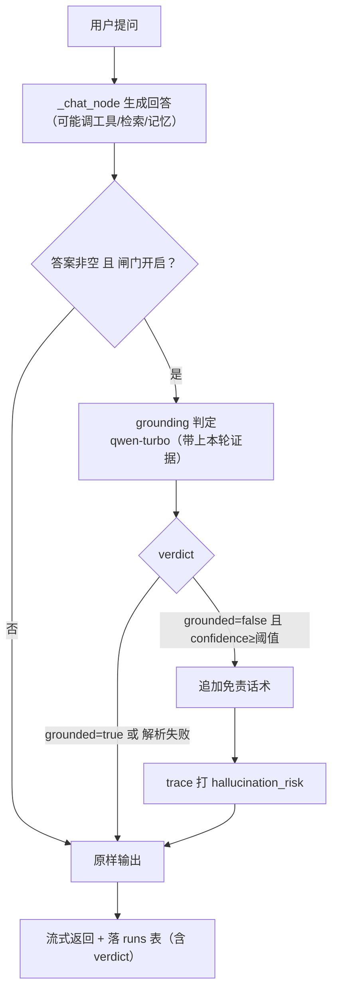

# 变更提案 · 幻觉闸门二期：有据也判（回答忠于证据校验）

> 状态：已确认
> 变更 ID：20260923-154738-hallucination-evidence
> 变更类型：新功能
> 分级：标准

## 1. 目标（一句话）

把幻觉闸门从「只判无据」扩展到「有据也判」：当回答有工具 / RAG 证据时，也把证据喂给判定模型，核对「回答是否忠于证据」，抓「查了但答错 / 答偏 / 编造证据里没有的事实」；降级仍默认「标注不拒答」。

## 2. 验收标准（怎么算「对」）

- [ ] 有工具/RAG 证据时也会跑判定（不再只判「无据」），证据真实传入判定模型
- [ ] 「回答与证据矛盾 / 编造证据外事实」会被判 grounded=false 并打 `hallucination_risk` + 追加免责话术
- [ ] 「回答忠于证据」不被误伤（含合理总结/省略）
- [ ] 无据场景行为不回退（v1 已通过的用例仍通过）
- [ ] 证据超长时截断，不顶破判定模型 token 预算
- [ ] 判定失败仍降级「不拦截只告警」；`GROUNDING_ENABLED` 仍是一键总开关
- [ ] 评测集扩充「有据但答错」样例后，precision/recall/F1 有回归基线

## 3. 依据

- **需求依据**：用户原话「Phase 3 二期吧先」（即「有据但答错」判定，本轮测试已确认 v1 只在「无据」触发、真实场景几乎不触发）。
- **技术依据**：
  - `apply_grounding` 已能拿到 `collector.tool_outputs` / `collector.retrieved_docs` / 记忆文本（`_extract_memory_text`）；v1 里 `build_evidence_text` 因触发条件保证证据恒空，实为死代码。
  - `GROUNDING_PROMPT` 已含「证据」段，只需补「忠于证据」判定规则。
  - 判定在 `stream_turn` 流式结束后跑，只加尾部延迟、不阻塞已出正文。
  - `GROUNDING_ENABLED` / `GROUNDING_CONFIDENCE_THRESHOLD` 已在 `config.py`。

## 4. 方案（怎么做 + 为什么选它）

**一句话方案**：放宽触发条件到「答案非空即判」，把真实证据（工具返回 + RAG 召回 + 记忆）传入判定，并在判定 prompt 里补「忠于证据」规则。

**为什么选它**：v1 只覆盖「无据」这个罕见场景，真正的常见幻觉是「查了但答错」；而判定模型拿得到证据、也能判断「回答是否与证据矛盾」，只是 v1 没把证据传进去、也没在「有据」时触发。

**关键设计点**：

1. **触发放宽**：删掉 `should_run_grounding` 的「无工具 + 无 RAG」限制；只要 `GROUNDING_ENABLED` 且答案非空就判。（`collector.has_flag` 不再用于触发判断）
2. **证据真实传入**：`apply_grounding` 把 `build_evidence_text(tool_outputs, retrieved_docs)` + 记忆文本拼成 evidence；新增 `EVIDENCE_MAX_CHARS`（默认 6000）截断，防顶破预算。
3. **判定 prompt 增强**：`GROUNDING_PROMPT` 补一条——「若提供了证据，判断回答是否忠于证据：歪曲证据内容、或断言证据中没有的事实 → 列为 ungrounded」。`PROMPT_VERSION` 1.1.0 → 1.2.0。
4. **降级话术**：统一为一句能同时覆盖「无据」与「与证据不符」的免责（如「以上回答可能存在事实性错误，请谨慎采信」）；拒答式仍留 config 扩展点。
5. **评测集扩充**：`hallucination_cases.json` 增加「有据但答错」样例（带 evidence 字段），`hallucination_eval.py` 支持传 evidence，复跑 F1。

### 方案流程图（mermaid）

## 5. 影响面（改哪些 / 明确不碰哪些）

**改**：
- `backend/agent/grounding.py`：删/简化 `should_run_grounding`、`apply_grounding` 传真实证据 + 截断、话术微调
- `backend/agent/prompts.py`：`GROUNDING_PROMPT` 补「忠于证据」规则 + `PROMPT_VERSION` 1.2.0
- `backend/eval/hallucination_eval.py` + `datasets/hallucination_cases.json`：加 evidence 支持 + 「有据但答错」样例
- `test/grounding/test_grounding.py`：更新触发/证据相关用例

**不碰**：
- 工具执行安全闸门（bash interrupt）、RAG 检索、记忆编排——不动
- trace 落库结构、前端渲染——不动（verdict/flag 呈现 v1 已做）
- 拒答式降级——仍留 config 扩展点，v2 不做

## 6. 风险与不确定点

1. **成本/延迟**：每轮多一次 qwen-turbo 调用。判定在流式完成后跑、只加尾部延迟；qwen-turbo 便宜；`GROUNDING_ENABLED` 可一键关。
2. **误伤**：判定模型可能把「合理省略/总结」误判为「歪曲」→ 阈值 + 「标注不拒答」兜底。
3. **证据口径**：工具返回可能含噪声（分页、代码、日志），判定模型可能被噪声带偏 → 证据截断 + 优先喂「检索召回 + 工具返回的关键字段」。
4. **长证据**：`shell` 输出可达 20KB，必须截断，否则 token 预算爆炸 → `EVIDENCE_MAX_CHARS` 兜底。
5. **「遗漏关键结果」未覆盖**：v2 只抓「歪曲/编造」，不抓「漏报」（更模糊），留三期。

## 7. 验证计划（预览）

- **pytest**：触发放宽、证据截断、`apply_grounding` 证据组装。
- **真实 API 冒烟**：构造「证据=返回 A，回答却说 B」的用例，验证 grounded=false；「回答忠于证据」验证 grounded=true。
- **评测基线**：扩充数据集后复跑 `hallucination_eval`，对比 v1 基线（F1=1.0）不退化。
- **独立验证 agent**：pytest / import / prompt_eval / 评测复跑 + 对照验收标准打灯。
